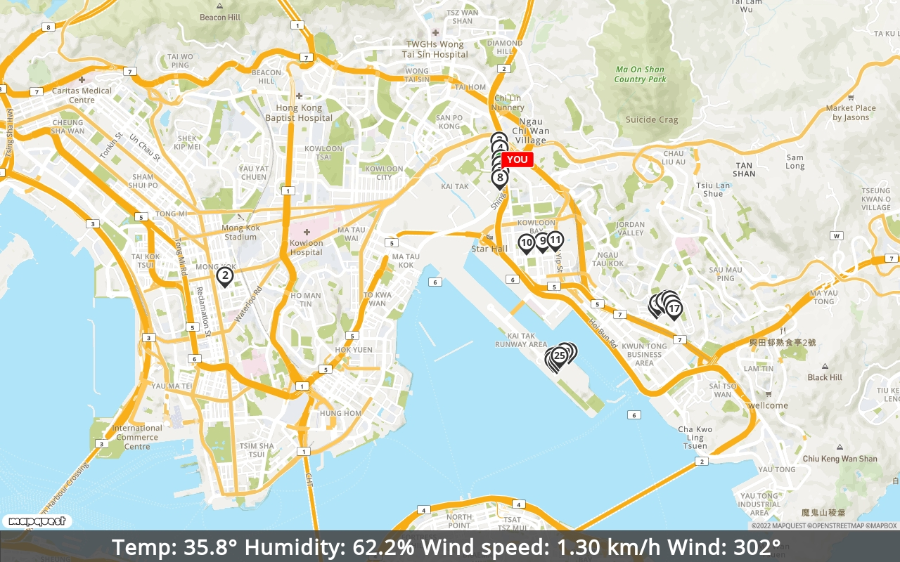
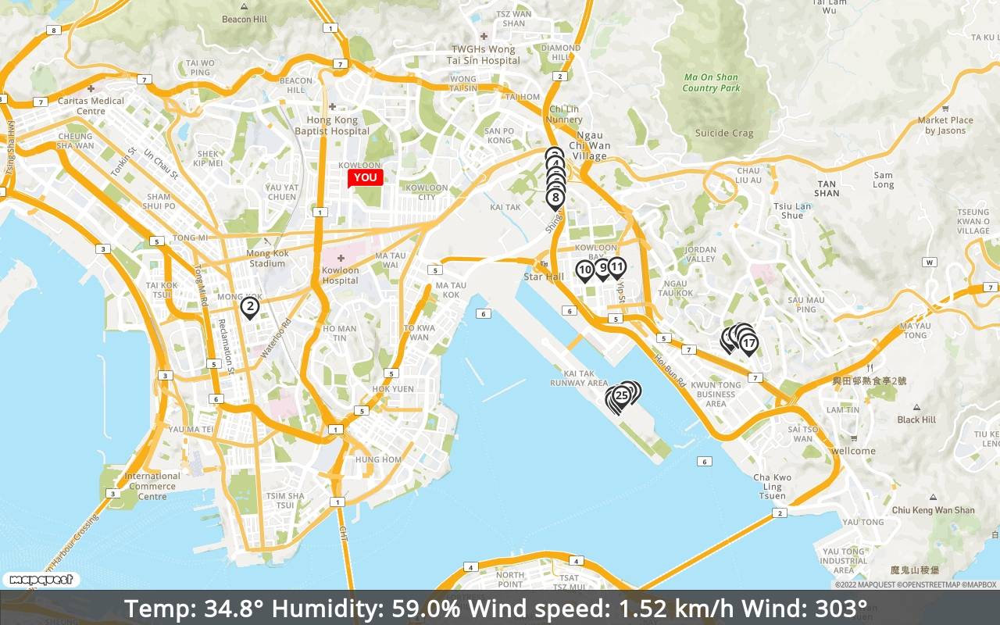
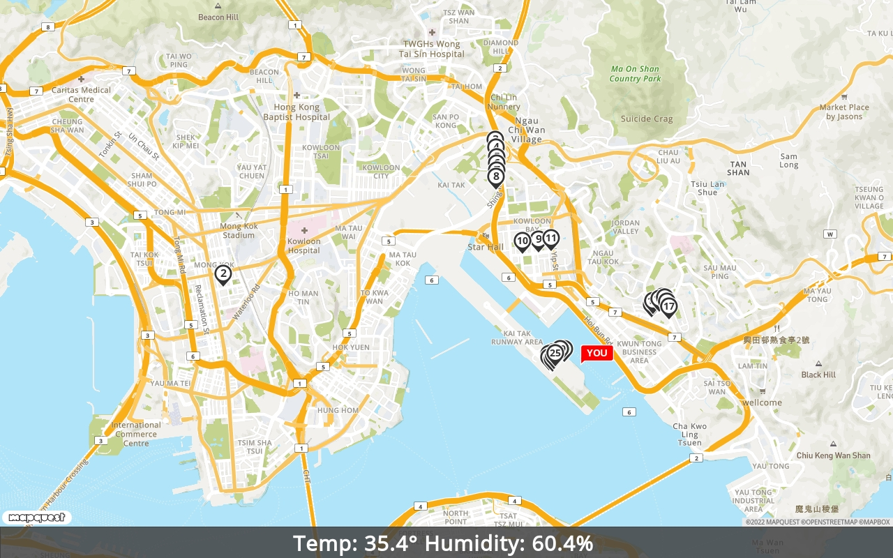

# Lamp Posts Contest

Here are 3 JSON files: the list of smart lampposts in HK, with details. Pick a GPS location under the form 22.271046, 114.186849 (not my location!) and parse the JSON file to get the closest lamppost. Pick the language you want. No libraries.

* [Devices Location](https://www.hko.gov.hk/common/hko_data/smart-lamppost/files/smart_lamppost_met_device_location.json)

* [Devices Types](https://www.hko.gov.hk/common/hko_data/smart-lamppost/files/smart_lamppost_met_device_type.json)

* [Devices Details](https://www.hko.gov.hk/common/hko_data/smart-lamppost/files/smart_lamppost_met_device_element.json)

The possible datapoints are:

```JSON
{
  "WD": "Wind Direction",
  "T0": "Air Temperature",
  "RH": "Relative Humidity",
  "W0": "10-minute wind speed"
}
```

Pick GPS coordinates within HK, and find the closest lamp post to that position. Get as much info as possible from the lamp post as you can. Something like this:

```sh
python3 lampposts.py

 • Loading Devices...
 • Loading Device Types...
 • Loading Device Details...

Closest lamp post: DF3644
 • coords: 22.331033, 114.204639
 • distance: 0.01 km
 • type: Full Suite Plus
 • https://data.weather.gov.hk/weatherAPI/smart-lamppost/smart-lamppost.php?pi=DF3644&di=01
 • Air Temperature = 32.3°
 • Relative Humidity = 69.4%
 • 10-minute wind speed = 0.53 km/h
 • Wind Direction = 4°
 • Timestamp: 2022/07/30 16:50:47
```



## UPDATES

### Command Args

There are now two commands you can use:

* `id=<lamp post ID>`	Retrieves a specific lamp post by ID number.

Example:

```sh
> python3 lampposts.py id=GF3837

 • Loading Devices...
 • Loading Device Types...
 • Loading Device Details...
Looking up Lamp Post ID GF3837

Closest lamp post: GF3837
 • coords: 22.308809, 114.211431
 • distance: 3.94 km
{'DEVICE_ID': '01', 'TYPE_NAME': 'Full Suite Plus', 'DATA_TYPE_COLLECTED': ['T0', 'RH', 'W0', 'WD'], 'dev': '01'}
 • type: Full Suite Plus
 • https://data.weather.gov.hk/weatherAPI/smart-lamppost/smart-lamppost.php?pi=GF3837&di=01
 • Air Temperature = 34.2°
 • Relative Humidity = 61.6%
 • 10-minute wind speed = 1.61 km/h
 • Wind Direction = 287°
 • Timestamp: 2022/07/31 14:20:36
 • Mapquest: https://www.mapquestapi.com/staticmap/v5/map?key=XXXXXXXXXXXXXXXX&center=22.3205725,114.198428&size=1280,800&zoom=14&locations=22.315157,114.224991||22.31777,114.171015||22.333017,114.204519||22.332194,114.204583||22.331033,114.204639||22.330369,114.20464||22.329522,114.204611||22.328862,114.204576||22.321696,114.209811||22.321498,114.207796||22.32187,114.211365||22.314322,114.22374||22.314722,114.223885||22.31493,114.224662||22.315073,114.225355||22.314587,114.225609||22.314045,114.225841||22.309247,114.212971||22.309188,114.212487||22.308809,114.211431|marker-start||22.308653,114.211115||22.308226,114.211083||22.308128,114.211521||22.308413,114.211648||22.308709,114.211864||22.331033,114.181639|flag-you-FF0000-FF0000&defaultMarker=marker-num&banner=Temp: 34.2°%20Humidity: 61.6%%20Wind speed: 1.61 km/h%20Wind: 287°%20

```



* `gps=lat,lng`

Example:

```sh
> python3 lampposts.py gps=22.308900,114.214984

 • Loading Devices...
 • Loading Device Types...
 • Loading Device Details...
Setting gps coords to 22.308900,114.214984

Closest lamp post: GF3831
 • coords: 22.309247, 114.212971
 • distance: 0.21 km
{'DEVICE_ID': '04', 'TYPE_NAME': 'Basic Suite', 'DATA_TYPE_COLLECTED': ['T0', 'RH'], 'dev': '04'}
 • type: Basic Suite
 • https://data.weather.gov.hk/weatherAPI/smart-lamppost/smart-lamppost.php?pi=GF3831&di=04
 • Air Temperature = 34.8°
 • Relative Humidity = 62.0%
 • Timestamp: 2022/07/31 14:20:18
 • Mapquest: https://www.mapquestapi.com/staticmap/v5/map?key=XXXXXXXXXXXXXXXX&center=22.3205725,114.198428&size=1280,800&zoom=14&locations=22.315157,114.224991||22.31777,114.171015||22.333017,114.204519||22.332194,114.204583||22.331033,114.204639||22.330369,114.20464||22.329522,114.204611||22.328862,114.204576||22.321696,114.209811||22.321498,114.207796||22.32187,114.211365||22.314322,114.22374||22.314722,114.223885||22.31493,114.224662||22.315073,114.225355||22.314587,114.225609||22.314045,114.225841||22.309247,114.212971|marker-start||22.309188,114.212487||22.308809,114.211431||22.308653,114.211115||22.308226,114.211083||22.308128,114.211521||22.308413,114.211648||22.308709,114.211864||22.3089,114.214984|flag-you-FF0000-FF0000&defaultMarker=marker-num&banner=Temp: 34.8° Humidity: 62.0% 

```


